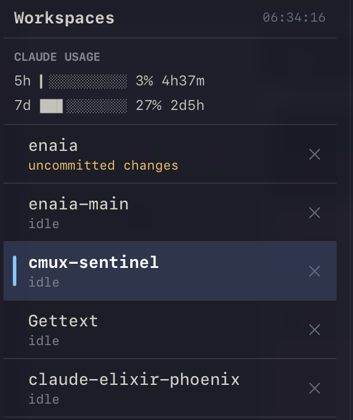

# cmux-sentinel

An opinionated [cmux](https://cmux.com) **custom sidebar** — a clean, monospace, Ayu-Mirage
workspaces list with live agent states and pluggable **AI usage meters**.

<p align="center">
  
</p>

The top **USAGE** panel shows live Claude limits (5h session + 7d weekly) with smooth sub-cell
bars — a 🟡/🔴 dot appears only when a limit gets close — and workspace rows light up by agent
state: **purple** (compacting) / **green** (working) / **orange** (needs you — including when an
agent asks a question or hits a permission prompt) / dim (idle).

It's a vibe-coded [custom sidebar](https://cmux.com/docs/custom-sidebars) (beta) plus small
background pollers. Batteries included, easy to fork and tweak.

## Features

- **Flat workspace list** in your manual order, SF Mono, Ayu-Mirage palette.
- **Live agent row states** (via a Claude Code hooks bridge): `compacting` (purple), `working`
  (green), `needs you` (orange — unread, or the agent asked a question / hit a permission prompt),
  `idle` (dim) — shown by row colour with a two-line subtitle that keeps agent activity separate
  from repo state (branch · dirty · PR). The header shows live per-state counts.
- **Inline actions**: click to select, `×` to close, unread badges.
- **Usage meters** — a top panel of live progress bars fed by background pollers. Ships with two
  providers — **Claude Code** (rolling 5-hour session + 7-day weekly, via the OAuth usage endpoint)
  and **Codex** (the same two windows, read from local `~/.codex` rollout files — no token, no
  network) — each with a smooth sub-cell Unicode bar, a `🟡`/`🔴` dot only when a limit gets close,
  and an `⚠ offline`/`⚠ stale` marker when data goes stale. Providers are opt-in and self-gating:
  an out-of-the-box install shows **Claude only**, and a provider that isn't installed can never
  appear or crash anything (see "Usage meters" below).

**Roadmap / help wanted:** more usage-meter providers — anything else that exposes a usage signal.
The meter mechanism is provider-agnostic (see "Usage meters" below), so adding one is mostly a
small poller script.

---

## How it works

cmux custom sidebars are runtime-interpreted SwiftUI-style files. The sidebar can only read a
fixed set of per-workspace fields — it **cannot** fetch URLs or read arbitrary data. Two
mechanisms feed it:

1. **Agent row states** — Claude Code hooks → `hooks/cmux-bridge.sh` → a STATIC marker on the
   *active* workspace's **title** (`⚡` working, `⏳` compacting, `❓` waiting-on-you — an agent that
   asked a question or hit a permission prompt), reference-counted so multiple agents in one
   workspace don't stomp it and dead sessions can't strand it. Precedence is compacting > waiting >
   working. The sidebar detects the marker, colours the row, and strips the glyph for display.
   (Why the title and not
   `set-progress`: progress doesn't reach custom-sidebar data on this build — see gotchas — and
   the marker must be *static*, since an animated one freezes cmux's sidebar.)
2. **Usage meters** — a poller (run by launchd every few minutes) computes each metric and writes
   it into a dedicated idle **"sentinel" workspace** by **renaming its title** (the same title
   channel). The sidebar matches sentinels by their **title label** (`5h`/`7d` prefix) and renders their
   titles in the top `USAGE` panel, hidden from the list. (cmux removed stable workspace ids in
   0.64.15, so the poller re-resolves each sentinel by title every run — restart-proof.)

```text
launchd ──► bin/cmux-claude-usage.sh --update
              ├─ read OAuth token ← macOS Keychain ("Claude Code-credentials")
              ├─ GET api.anthropic.com/api/oauth/usage   (5h + 7d utilization + reset times)
              └─ cmux rename-workspace <sentinel> "5h ██▍░░░░░░░ 24% 2d18h" ─► sidebar reads w.title
```

---

## Install

### Install with your AI agent (recommended)

Already running Claude Code, Codex, or Cursor? Paste this and let it do the whole setup —
including the steps people skip by hand (wiring the Claude Code hooks and creating the usage
sentinels):

```text
Install cmux-sentinel (a custom cmux sidebar + Claude-Code agent-state bridge +
AI usage meters) on this Mac for me.

Fetch this guide and follow it exactly, top to bottom:
https://raw.githubusercontent.com/oliver-kriska/cmux-sentinel/main/docs/agent-install.md

Rules:
- It's idempotent and backs up anything it changes — do the file edits yourself
  (e.g. merging the hooks block into ~/.claude/settings.json), don't ask me to.
- When done, run ~/bin/cmux-sentinel-doctor.sh and show me the output. If a check
  isn't green, fix it per the guide and re-run the doctor until it's clean.
- Stop and ask me only if cmux isn't installed/running or Claude Code isn't logged in.
- After registering hooks, remind me to fully restart Claude Code.
```

The agent follows [`docs/agent-install.md`](docs/agent-install.md) — read it first if you want
to see exactly what it will run. Prefer to do it by hand? Use the manual steps below.

### Manual install

One-liner — clones to `~/.cache/cmux-sentinel` and runs the installer:

```bash
curl -fsSL https://raw.githubusercontent.com/oliver-kriska/cmux-sentinel/main/install.sh | bash
# also install the working-state hooks AND auto-wire them into ~/.claude/settings.json:
curl -fsSL https://raw.githubusercontent.com/oliver-kriska/cmux-sentinel/main/install.sh | WITH_BRIDGE=1 bash
```

Or clone it yourself:

```bash
git clone https://github.com/oliver-kriska/cmux-sentinel.git
cd cmux-sentinel
./install.sh                 # add WITH_BRIDGE=1 to also install + wire the working-state hooks
```

`install.sh` copies the files into place (backing up anything it overwrites) and prints the
remaining manual steps. In short:

1. **Create two sentinel workspaces** in cmux (any dir) and name them so their **titles start with
   the labels** — that's the whole wiring, no ids to copy (cmux 0.64.15 dropped stable workspace
   UUIDs, so the poller + sidebar match by title): `cmux rename-workspace --workspace workspace:<N>
   "5h"` (one for `5h`, one for `7d`). To use different labels, set `SENTINEL_5H_LABEL` /
   `SENTINEL_7D_LABEL` in `~/.config/cmux/usage-sentinels.env` and the matching `hasPrefix()` in the
   sidebar's `isClaudeMeter()`.
2. **Test the poller:** `~/bin/cmux-claude-usage.sh --print` then `--update`.
3. **Load the sidebar:** `cmux sidebar validate workspaces && cmux sidebar reload`, then
   right-click the sidebar button and pick *workspaces*.
4. **Enable external socket access** for auto-refresh — add
   `"automation": { "socketControlMode": "automation" }` to `~/.config/cmux/cmux.json`, then run
   `cmux reload-config` (applies live on current builds; if renames still get rejected, restart cmux).
5. **Start auto-refresh:**
   `launchctl bootstrap gui/$(id -u) ~/Library/LaunchAgents/com.cmux-claude-usage.plist`.
6. **Verify the pipeline:** `make doctor` (or `~/bin/cmux-sentinel-doctor.sh`) — a read-only check
   that the bridge, hooks, launchd job, automation mode, and sentinels are all wired.

### Working-state rows (the hooks bridge)

`WITH_BRIDGE=1 ./install.sh` installs the bridge **and auto-wires** the Claude Code hook events
into `~/.claude/settings.json` (idempotent, backed up) — then **restart Claude Code** so the new
events register. Without the bridge, every row shows `idle`; with it you get `⚡ working` /
`⏳ compacting` / `❓ waiting-on-you`.

If the installer couldn't edit `settings.json` (no `jq`, or it wasn't valid JSON), add this under
`"hooks"` by hand (keep any existing hooks; all entries are fire-and-forget), then restart Claude
Code:

```json
{
  "hooks": {
    "SessionStart":       [{ "matcher": "", "hooks": [{ "type": "command", "command": "~/.claude/hooks/cmux-bridge.sh", "async": true }] }],
    "UserPromptSubmit":   [{ "matcher": "", "hooks": [{ "type": "command", "command": "~/.claude/hooks/cmux-bridge.sh", "async": true }] }],
    "PreToolUse":         [{ "matcher": "", "hooks": [{ "type": "command", "command": "~/.claude/hooks/cmux-bridge.sh", "async": true }] }],
    "PreCompact":         [{ "matcher": "", "hooks": [{ "type": "command", "command": "~/.claude/hooks/cmux-bridge.sh", "async": true }] }],
    "PostCompact":        [{ "matcher": "", "hooks": [{ "type": "command", "command": "~/.claude/hooks/cmux-bridge.sh", "async": true }] }],
    "Stop":               [{ "matcher": "", "hooks": [{ "type": "command", "command": "~/.claude/hooks/cmux-bridge.sh", "async": true }] }],
    "StopFailure":        [{ "matcher": "", "hooks": [{ "type": "command", "command": "~/.claude/hooks/cmux-bridge.sh", "async": true }] }],
    "Notification":       [{ "matcher": "", "hooks": [{ "type": "command", "command": "~/.claude/hooks/cmux-bridge.sh", "async": true }] }],
    "PostToolUseFailure": [{ "matcher": "", "hooks": [{ "type": "command", "command": "~/.claude/hooks/cmux-bridge.sh", "async": true }] }],
    "SessionEnd":         [{ "matcher": "", "hooks": [{ "type": "command", "command": "~/.claude/hooks/cmux-bridge.sh", "async": true }] }]
  }
}
```

`Notification` drives `❓ waiting-on-you` (permission prompts); `UserPromptSubmit`/`PreToolUse`
drive `⚡ working`; `PreCompact`/`PostCompact` drive `⏳ compacting`; `Stop`/`SessionEnd` clear it.

**Prereqs:** macOS, cmux (custom sidebars / beta), Claude Code logged in, `jq`, `curl`, `git`.

## Updating

There's no separate updater — **re-run the installer**. It re-deploys every file and backs up
what it replaces.

```bash
# curl install — the bootstrap git-pulls ~/.cache/cmux-sentinel, then re-installs:
curl -fsSL https://raw.githubusercontent.com/oliver-kriska/cmux-sentinel/main/install.sh | bash

# git clone:
git -C cmux-sentinel pull && cmux-sentinel/install.sh
```

Then `cmux sidebar reload` to repaint. Notes:

- An **already-installed bridge updates automatically** on a plain re-run — no `WITH_BRIDGE=1`
  needed (that flag is only for *adding* the bridge the first time).
- The launchd poller picks up the new script on its next run; **bridge script-body changes are
  read live**, so only a brand-new hook-event *registration* needs a Claude Code restart.
- `make doctor` (or `~/bin/cmux-sentinel-doctor.sh`) confirms everything is still wired afterward.

---

## Usage meters (providers)

Each provider gets its **own labelled section** in the panel — `CLAUDE USAGE` and `CODEX USAGE` —
the same component reused. A meter is just an idle "sentinel" workspace whose **title** a poller
keeps updated.

### Choosing which providers show (and never crashing on a missing one)

The sidebar can't read a config file — it can only react to workspace data — so **which providers
show is decided by which sentinels exist**, and the sidebar **auto-hides any provider with zero
sentinels** (each panel is guarded by a `count > 0`). That makes provider selection a setup choice,
not a sidebar edit, and gives three robustness guarantees:

- **A provider you don't use never appears.** No Codex poller + no Codex sentinels ⇒ no Codex panel.
  (So an out-of-the-box install is **Claude-only** — exactly what most people want.)
- **An *uninstalled* provider can't break anything.** Each poller **self-gates**: if its provider
  isn't installed here (e.g. no Claude credentials in the Keychain *or* `~/.claude/.credentials.json`)
  it **exits 0 silently** — no launchd error spam, no stale "offline" panel. The sidebar itself only
  ever reads titles, so it can't crash on a missing CLI either. An *expired* token is different — the
  creds still exist, so it's treated as a transient `⚠ offline` rather than "not installed".
- **You can disable a provider you *do* have installed.** Set `USAGE_PROVIDERS` in
  `~/.config/cmux/usage-sentinels.env` (space-separated; default `claude`). Drop a name to make that
  poller a no-op without unloading launchd; then `cmux workspace close` its sentinels to remove the
  panel. `~/bin/cmux-sentinel-doctor.sh` reports installed × enabled × sentinel-present and flags any
  leftover panel.

### Enable the Codex provider

Codex ships built-in but is **off by default** (out-of-the-box is Claude-only). To turn it on:

1. **Enable the poller:** add `codex` to `USAGE_PROVIDERS` in `~/.config/cmux/usage-sentinels.env`,
   e.g. `USAGE_PROVIDERS="claude codex"` (or just `"codex"` to disable Claude). With the name
   absent the Codex poller is a no-op, so this is the on/off switch.
2. **Create two sentinel workspaces** and name them so their titles start with the Codex labels:
   `cmux rename-workspace --workspace workspace:<N> "cx5h"` (one for `cx5h`, one for `cx7d`).
   Override `SENTINEL_CX5H_LABEL` / `SENTINEL_CX7D_LABEL` in the env file if you want different
   labels (match them in the sidebar's `isCodexMeter()`).
3. **Test:** `~/bin/cmux-codex-usage.sh --print`, then `--update`.
4. **Schedule it:** `install.sh` already deployed `~/Library/LaunchAgents/com.cmux-codex-usage.plist`
   (dormant). Just load it: `launchctl bootstrap gui/$(id -u)
   ~/Library/LaunchAgents/com.cmux-codex-usage.plist`.

`~/bin/cmux-sentinel-doctor.sh` cross-checks installed × enabled × sentinel-present for both
providers. If Codex isn't installed (`codex` not on PATH and no `~/.codex/sessions`), the poller
exits cleanly and no panel shows.

### Add a NEW provider

The two built-in providers (Claude, Codex) are the template. To add a third:

1. Create a sentinel workspace with a distinct label (a prefix that can't collide with the others).
   In `sidebars/workspaces.swift`: add an `isXMeter(w)` predicate (copy `isCodexMeter`, swap the
   `hasPrefix` label), add `if isXMeter(w) { return true }` to `isUsageMeter`, and add an `X USAGE`
   section to the panel (copy the `CODEX USAGE` block).
2. Write a small poller (copy `bin/cmux-codex-usage.sh` or `cmux-claude-usage.sh`) — keep the
   self-gating pattern: a `provider_available()` (detect the provider's creds/CLI/data) + a
   `PROVIDER_ID` checked against `USAGE_PROVIDERS`, so it exits cleanly when the provider is absent
   or disabled. It computes usage and does
   `cmux rename-workspace --workspace <ref> "<label> <bar> <pct>% <reset>"`.
3. Schedule it (launchd) like the others. Users who want it run its poller; users who don't, don't.

PRs adding providers are very welcome.

### Codex provider — data source

Codex writes a per-turn rate-limit snapshot into its **local** session rollout files — no token, no
network:

```text
~/.codex/sessions/<YYYY>/<MM>/<DD>/rollout-<ts>-<uuid>.jsonl
  └─ a "rate_limits" object: { primary: {used_percent, window_minutes:300,   resets_at},
                               secondary:{used_percent, window_minutes:10080, resets_at} }
```

`primary` = the rolling 5-hour window, `secondary` = the weekly window — the same two the Claude
meter shows. The poller scans the newest rollout files and takes the **latest non-null** snapshot
(Codex frequently writes `rate_limits: null`, especially in `codex exec`/non-interactive runs —
[openai/codex#14880](https://github.com/openai/codex/issues/14880)); if none is found it stamps
`⚠ stale`. This schema is **community-observed, not an OpenAI contract**, so the poller parses
defensively (recursive search for `rate_limits`, tolerant of missing keys, accepts `resets_at` or
`resets_in_seconds`).

### Claude provider — data source

```http
GET https://api.anthropic.com/api/oauth/usage
Authorization: Bearer <oauth_access_token>
anthropic-beta: oauth-2025-04-20
```

Unofficial / beta (the same endpoint `ccusage statusline` uses; header may change). Buckets
`five_hour`, `seven_day`, `seven_day_opus`, `seven_day_sonnet`, … each `{ utilization: 0-100,
resets_at }`. Use `seven_day.resets_at` for the weekly reset — Anthropic's 7-day window **rolls**,
so local calendar-week math (`ccusage weekly`) is wrong. Token is read fresh from the macOS
Keychain each run; never stored or printed.

---

## Interpreter gotchas

The cmux sidebar runs a **subset** of SwiftUI. Hard-won facts (respect these in PRs):

- **`set-progress` / `description` / `color` do NOT reach custom-sidebar data at all** — not even
  for the selected, working workspace (proven by probe). **`title` is the only writable channel**, so
  usage bars AND the agent working/compacting markers all ride the title string. (`cmux sidebar-state`
  shows the canonical store and diverges from what the sidebar actually sees — don't trust it to
  predict the sidebar.)
- **String `.hasPrefix` / `.contains` / `.split` DO work** here — the marker detection relies on
  them. (An older note claimed they blank-render; that was disproven on the current build.) `==`
  works too. Avoid `||`; use an `if`-chain returning early.
- **No value-accurate native bar** (`ProgressView`/`Capsule`) for meters — a drawn bar needs the %
  as a number, but you only have it as a string in the title and the interpreter can't reliably
  parse it back. Hence Unicode block text bars. Likewise utilization **color** can only come from a
  colored emoji in the title.
- `Divider().background(...)` and `.frame(maxHeight: .infinity)` are **greedy** and wreck row
  height. `.contentShape(Rectangle())` is a no-op. Custom fonts aren't honored — use
  `.system(size:, design: .monospaced)`.
- `cmux sidebar validate` only **parses**; it passes on layouts that render blank. Bisect runtime
  errors by stripping the body to `Text("hi")` and adding back piece by piece.

The full, standalone version of these traps (plus the blank-sidebar debugging method) lives in
[docs/cmux-custom-sidebar-cheatsheet.md](docs/cmux-custom-sidebar-cheatsheet.md) — a one-screen field
guide that complements cmux's official [authoring reference](https://cmux.com/docs/custom-sidebars).

## Layout

```text
bin/cmux-claude-usage.sh     Claude usage poller — OAuth usage endpoint (--print | --raw | --update)
bin/cmux-codex-usage.sh      Codex usage poller — local ~/.codex rollout files (--print | --raw | --update)
bin/cmux-sentinel-doctor.sh  read-only health-check of the whole pipeline (both providers)
sidebars/workspaces.swift    the sidebar (the opinionated design + USAGE panels)
hooks/cmux-bridge.sh         Claude Code → cmux agent-state bridge (⚡ working / ⏳ compacting / ❓ waiting-on-you)
tests/bridge-state.sh        offline bridge state-machine test (stubs cmux; `make test`)
tests/poller-gate.sh         offline Claude poller provider-gating test
tests/codex-poller.sh        offline Codex poller gating + rollout-parsing test
examples/                    usage-sentinels.env + launchd plist templates (Claude + Codex)
install.sh                   file placement + next-steps
```

## Security

The OAuth token is read fresh from the macOS Keychain on every poll and sent only to
`api.anthropic.com` — never written to disk, logged, or printed. Nothing in this repo contains a
token; sentinel UUIDs are placeholders you fill in locally.

## Contributing

See [CONTRIBUTING.md](CONTRIBUTING.md). New meter providers, theme variants, and gotcha additions
are all welcome. MIT licensed.
