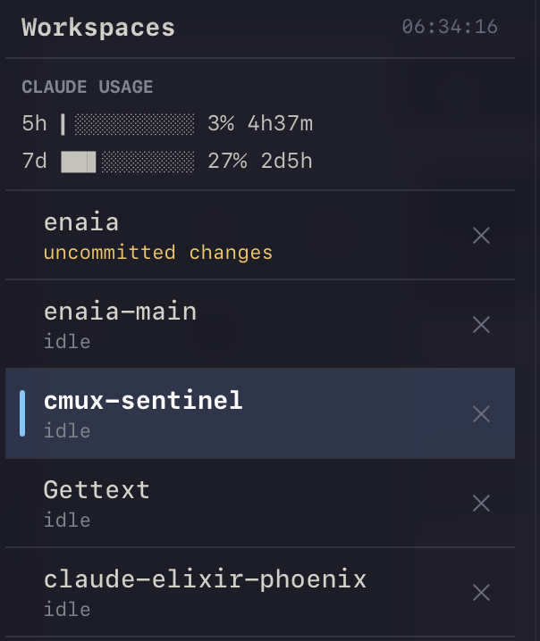

# cmux-sentinel

An opinionated [cmux](https://cmux.com) **custom sidebar** — a clean, monospace, Ayu-Mirage
workspaces list with live agent states and pluggable **AI usage meters**.

<p align="center">
  
</p>

The top usage panels show live Claude, Codex, and Amp allowances with native progress bars (plus a
title fallback) and compact countdowns such as `28% (1h 54m)`. Workspace rows use a quiet state hierarchy: **purple**
(compacting), **green** (working), **orange** (needs you), selected blue, and neutral idle.

It's a vibe-coded [custom sidebar](https://cmux.com/docs/custom-sidebars) (beta) plus small
background pollers. Batteries included, easy to fork and tweak.

## Features

- **Flat workspace list** in your manual order, SF Mono, Ayu-Mirage palette.
- **Live agent row states** (via Claude Code hooks or the Amp plugin): `compacting` (purple), `working`
  (green), `needs you` (orange — unread, or the agent asked a question / hit a permission prompt),
  and `idle` (dim). Idle repo rows omit redundant `idle`; active rows keep activity and repo state
  separate. The header shows action-needed first, then working and compacting counts.
- **Inline actions**: click to select, an always-visible high-contrast `×` to close, pin indicators,
  unread badges, and honest `⌘N` hints that preserve cmux's real shortcut gaps.
- **Workspace-group names** (opt-in) — cmux gives custom sidebars no group data, so a group shows
  its anchor's generic "Group 2" instead of its real name. A small background sync
  (`GROUP_NAME_SYNC=1`) keeps each group's anchor title in step with the group name (see "Workspace
  group names" below). Off by default; a no-op if you don't use groups.
- **Usage meters** — provider-labelled native progress bars fed by background pollers. Ships with
  **Claude Code** (5-hour session + 7-day week), **Codex** (whatever short/weekly windows the account
  currently reports), and **Amp** (monthly thread allowance plus opt-in orb allowance). The title
  remains a restart-proof anchor and fallback. Providers are opt-in and self-gating: the default
  provider set is **Claude only**, and an unavailable provider's poller exits cleanly. Panels are
  controlled separately by sentinel presence (see "Usage meters" below).

**Roadmap / help wanted:** more usage-meter providers — anything else that exposes a usage signal.
The meter mechanism is provider-agnostic (see "Usage meters" below), so adding one is mostly a
small poller script.

---

## How it works

cmux custom sidebars are runtime-interpreted SwiftUI-style files. The sidebar can only read a
fixed set of per-workspace fields — it **cannot** fetch URLs or read arbitrary data. Two
mechanisms feed it:

1. **Agent row states** — Claude Code hooks or `hooks/amp-bridge.ts` → `hooks/cmux-bridge.sh` → a STATIC marker on the
   *active* workspace's **title** (`⚡` working, `⏳` compacting, `❓` waiting-on-you — an agent that
   asked a question or hit a permission prompt), reference-counted so multiple agents in one
   workspace don't stomp it and dead sessions can't strand it. Precedence is compacting > waiting >
   working. The sidebar detects the marker, colours the row, and strips the glyph for display.
   Agent state stays in the title because it must survive app/process boundaries and be shared by
   co-tenant agents; an animated marker would freeze cmux's title coalescer.
2. **Usage meters** — a poller (run by launchd every few minutes) computes each metric and writes
   it into a dedicated idle **"sentinel" workspace** using both `set-progress` (the native bar and
   label) and a title rename (stable anchor + fallback). The sidebar matches sentinels by title
   label, hides them from the workspace list, and humanizes those labels for display. cmux removed
   stable workspace ids in 0.64.15, so every poll re-resolves the live title across all windows.

```text
launchd ──► bin/cmux-claude-usage.sh --update
              ├─ read OAuth token ← Claude-owned Keychain item or credentials JSON
              ├─ GET api.anthropic.com/api/oauth/usage   (5h + 7d utilization + reset times)
              ├─ cmux rename-workspace <sentinel> "5h |24% (2h 18m)|███░…" (anchor/fallback)
              └─ cmux set-progress 0.24 --label "24% (2h 18m)" (native bar)
```

---

## Install

### Install with your AI agent (recommended)

Already running Claude Code, Codex, or Cursor? Paste this and let it do the whole setup —
including the steps people skip by hand (wiring the Claude Code hooks and creating the usage
sentinels):

```text
Install cmux-sentinel (a custom cmux sidebar + Claude-Code agent-state bridge +
AI usage meters) on this Mac for me.

Fetch this guide and follow it exactly, top to bottom:
https://raw.githubusercontent.com/oliver-kriska/cmux-sentinel/main/docs/agent-install.md

Rules:
- It's idempotent and backs up anything it changes — do the file edits yourself
  (e.g. merging the hooks block into ~/.claude/settings.json), don't ask me to.
- When done, run ~/bin/cmux-sentinel-doctor.sh and show me the output. If a check
  isn't green, fix it per the guide and re-run the doctor until it's clean.
- Stop and ask me only if cmux isn't installed/running or a required dependency is missing.
- After registering hooks, remind me to fully restart Claude Code.
```

The agent follows [`docs/agent-install.md`](docs/agent-install.md) — read it first if you want
to see exactly what it will run. Prefer to do it by hand? Use the manual steps below.

### Install with Homebrew

```bash
brew install oliver-kriska/tap/cmux-sentinel
cmux-sentinel deploy      # puts the files where cmux and launchd expect them
cmux-sentinel doctor      # confirm the pipeline is wired
```

`deploy` is not optional, and it is needed after every `brew upgrade` too. Homebrew owns the files
under its own prefix; the sidebar lives in `~/.config/cmux/sidebars`, the pollers in `~/bin` and
four launchd agents call them there — so a new formula on its own changes nothing that is running.
`cmux-sentinel version` prints both numbers and tells you when they've drifted apart.

### Manual install

One-liner — clones to `~/.cache/cmux-sentinel` and runs the installer:

```bash
curl -fsSL https://raw.githubusercontent.com/oliver-kriska/cmux-sentinel/main/install.sh | bash
# also install the working-state hooks AND auto-wire them into ~/.claude/settings.json:
curl -fsSL https://raw.githubusercontent.com/oliver-kriska/cmux-sentinel/main/install.sh | WITH_BRIDGE=1 bash
```

Or clone it yourself:

```bash
git clone https://github.com/oliver-kriska/cmux-sentinel.git
cd cmux-sentinel
./install.sh                 # add WITH_BRIDGE=1 to also install + wire the working-state hooks
                             # add --with-zed  (or WITH_ZED=1) for the opt-in Zed integration
```

| Integration | Flag/config | Effect |
| --- | --- | --- |
| Claude states | `--with-bridge` / `WITH_BRIDGE=1` | Installs the shared bridge under `~/.claude/hooks` and registers Claude Code events |
| Amp states | `--with-amp` / `WITH_AMP=1` | Installs the Amp plugin plus its neutral shared dependency under `~/.config/cmux-sentinel` |
| Zed | `--with-zed` / `WITH_ZED=1` | Installs and registers the opt-in Zed helpers |
| Usage providers | `USAGE_PROVIDERS` | Chooses `claude`, `codex`, and/or `amp` meter pollers; default is `claude` |
| Reload changed jobs | `--reload-agents` / `RELOAD_AGENTS=1` | Reloads only launchd jobs whose generated plist changed and is already loaded |

Amp-only installation does **not** register Claude hooks. If both agents are enabled, they still use
the same ref-counted state model so one agent ending cannot clear another agent's active marker.

`install.sh` copies the files into place (backing up anything it overwrites) and prints the
remaining manual steps. In short:

1. **Create the sentinel workspaces.** Easiest — run `~/bin/cmux-sentinel-setup.sh`: it creates the
   meter workspaces for your enabled providers (idempotent, skips positively absent provider
   windows, keeps Amp orbs opt-in, and warns if cmux's global auto-naming could rename them). Or by
   hand: create idle workspaces and name them so
   their **titles start with the labels** — no ids to copy (cmux 0.64.15 dropped stable workspace
   UUIDs, so the poller + sidebar match by title): `cmux rename-workspace --workspace workspace:<N>
   "5h"` (one for `5h`, one for `7d`). To use different labels, set `SENTINEL_5H_LABEL` /
   `SENTINEL_7D_LABEL` in `~/.config/cmux/usage-sentinels.env` and the matching `hasPrefix()` in the
   sidebar's `isClaudeMeter()`. (Sentinels can live in any window — the poller scans all windows —
   but keep them in the window where the sidebar is shown, since the sidebar renders per-window.)
2. **Test and paint enabled providers:** run each enabled provider's poller with `--print`, then
   `--update`. The setup script prints the exact update commands for the configured provider set.
3. **Load the sidebar:** `cmux sidebar validate workspaces && cmux sidebar reload && cmux sidebar
   select workspaces`.
4. **Enable external socket access** for auto-refresh — add
   `"automation": { "socketControlMode": "automation" }` to `~/.config/cmux/cmux.json`, then run
   `cmux reload-config` (applies live on current builds; if renames still get rejected, restart cmux).
5. **Start auto-refresh:** bootstrap the matching launchd plist for each enabled provider if it is
   not already loaded: `com.cmux-claude-usage.plist`, `com.cmux-codex-usage.plist`, and/or
   `com.cmux-amp-usage.plist` under `~/Library/LaunchAgents/`. On an update, launchd does not reread
   a changed loaded plist: the installer prints exact `bootout` + `bootstrap` commands, or
   `./install.sh --reload-agents` safely reloads only jobs that are both changed and loaded.
6. **Verify the pipeline:** `make doctor` (or `~/bin/cmux-sentinel-doctor.sh`) — a read-only check
   that the bridge, hooks, launchd job, automation mode, sentinels, and recent successful provider
   updates are all present. Each complete `--update` records a local epoch stamp; doctor warns after
   15 minutes without success, so a loaded-but-stuck launchd job cannot leave a plausible stale bar.

### Working-state rows (the hooks bridge)

`WITH_BRIDGE=1 ./install.sh` installs the bridge **and auto-wires** the Claude Code hook events
into `~/.claude/settings.json` (idempotent, backed up) — then **restart Claude Code** so the new
events register. Without the bridge, every row shows `idle`; with it you get `⚡ working` /
`⏳ compacting` / `❓ waiting-on-you`.

If the installer couldn't edit `settings.json` (no `jq`, or it wasn't valid JSON), add this under
`"hooks"` by hand (keep any existing hooks; all entries are fire-and-forget), then restart Claude
Code:

```json
{
  "hooks": {
    "SessionStart":       [{ "matcher": "", "hooks": [{ "type": "command", "command": "~/.claude/hooks/cmux-bridge.sh", "async": true }] }],
    "UserPromptSubmit":   [{ "matcher": "", "hooks": [{ "type": "command", "command": "~/.claude/hooks/cmux-bridge.sh", "async": true }] }],
    "PreToolUse":         [{ "matcher": "", "hooks": [{ "type": "command", "command": "~/.claude/hooks/cmux-bridge.sh", "async": true }] }],
    "PreCompact":         [{ "matcher": "", "hooks": [{ "type": "command", "command": "~/.claude/hooks/cmux-bridge.sh", "async": true }] }],
    "PostCompact":        [{ "matcher": "", "hooks": [{ "type": "command", "command": "~/.claude/hooks/cmux-bridge.sh", "async": true }] }],
    "Stop":               [{ "matcher": "", "hooks": [{ "type": "command", "command": "~/.claude/hooks/cmux-bridge.sh", "async": true }] }],
    "StopFailure":        [{ "matcher": "", "hooks": [{ "type": "command", "command": "~/.claude/hooks/cmux-bridge.sh", "async": true }] }],
    "Notification":       [{ "matcher": "", "hooks": [{ "type": "command", "command": "~/.claude/hooks/cmux-bridge.sh", "async": true }] }],
    "PostToolUseFailure": [{ "matcher": "", "hooks": [{ "type": "command", "command": "~/.claude/hooks/cmux-bridge.sh", "async": true }] }],
    "SessionEnd":         [{ "matcher": "", "hooks": [{ "type": "command", "command": "~/.claude/hooks/cmux-bridge.sh", "async": true }] }]
  }
}
```

`Notification` drives `❓ waiting-on-you` (permission prompts); `UserPromptSubmit`/`PreToolUse`
drive `⚡ working`; `PreCompact`/`PostCompact` drive `⏳ compacting`; `Stop`/`SessionEnd` clear it.

Markers are reference-counted per workspace and reaped two ways: the session's process dying
(`kill -0`), and the session going quiet. The second one matters because a turn can end without
ever firing `Stop` — an Esc-interrupt that leaves the session alive, or an agent host process that
outlives the turn — and a marker whose process is genuinely still alive would otherwise stay pinned
indefinitely. Working/compacting state that has not been refreshed for `CMUX_SENTINEL_WORK_TTL`
seconds (default `3600`; `0` restores pure process-liveness) is treated as a finished turn and
cleared at the next reconcile. `❓ waiting-on-you` is deliberately exempt — nothing refreshes it
while you are away from the keyboard, so it never expires on a timer.

### Amp working-state rows (opt-in)

`./install.sh --with-amp` installs `~/.config/amp/plugins/cmux-sentinel-amp.ts` and the neutral
bridge dependency it calls. Amp provides working/idle state; it has no compaction event, and
waiting-on-you is off unless you explicitly set `CMUX_SENTINEL_AMP_ASK=1` (which changes Amp to ask
before configured tools). Also run `cmux hooks amp install` for cmux's separate native-sidebar
integration; the two plugins coexist and serve different sidebars.

### Using Zed alongside cmux (opt-in, off by default)

If you keep cmux for terminals/agents but reach for [Zed](https://zed.dev) as your editor + git UI,
`install.sh --with-zed` (or `WITH_ZED=1 ./install.sh`) adds three personal helpers: a **cmux→Zed
worktree handoff** (`ze` / `Ctrl-O` opens Zed on the current git worktree — no window-switching and
project/worktree re-picking), the same **agent-state markers** (`⚡`/`⏳`/`❓`) written to OSC-2
terminal metadata + a JSON status sink, and a **usage-meter pane** for Zed's terminal. Stock Zed's
native tab label remains process-derived; the JSON is the durable input for a future panel. It's wired
into nothing until you `export ZED_SENTINEL=1`, so a default install stays Zed-free and other users
of this repo are unaffected. Full setup and every toggle: [`docs/zed-integration.md`](docs/zed-integration.md).

**Prereqs:** macOS, cmux (custom sidebars / beta), `jq`, `curl`, and `git`. Provider-specific meters
also require that provider's CLI/account credentials.

## One command: `cmux-sentinel`

The installer drops a small dispatcher at `~/bin/cmux-sentinel` so you don't have to remember nine
script names:

```bash
cmux-sentinel setup            # create/repair the sentinel workspaces + re-park them out of ⌘1…⌘9
cmux-sentinel doctor           # read-only health report for the whole pipeline
cmux-sentinel version          # what's installed, when, from which commit
cmux-sentinel usage            # --print every enabled provider (read-only; add --raw etc.)
cmux-sentinel paint            # --update every enabled provider (writes the meters now)
cmux-sentinel deploy           # (re-)install this version's files into ~/bin and ~/.config
cmux-sentinel update           # fetch the latest release and install it
cmux-sentinel group-sync --list
cmux-sentinel zed              # open Zed on the current worktree (opt-in helper)
```

It's a dispatcher, not a replacement: every `~/bin/cmux-*.sh` script stays exactly where it is and
keeps working when called directly — the LaunchAgents reference them by absolute path, so moving
them would silently stop the meters on every already-bootstrapped install. Arguments and exit
statuses pass straight through (`cmux-sentinel usage --raw` is `cmux-claude-usage.sh --raw`).

## Updating

There's no separate updater — **re-run the installer**. It re-deploys every file, backs up what it
replaces, then **finishes the job**: it re-runs setup (so a release that adds a meter gets its
workspace, and the sentinels are re-parked out of ⌘1…⌘9), repaints every enabled provider, and
reloads the sidebar. Pass `--no-setup` if you want files only.

Check what you have with `cmux-sentinel version` (or the header of `cmux-sentinel doctor`) — it
reports the installed version, date and commit, and tells you when a newer one is published
(`CMUX_SENTINEL_UPDATE_CHECK=0` turns the check off). `cmux-sentinel update` re-runs the installer
from your git checkout.

```bash
# Homebrew — two steps, because brew cannot write to $HOME:
brew upgrade cmux-sentinel && cmux-sentinel deploy

# curl install — the bootstrap git-pulls ~/.cache/cmux-sentinel, then re-installs:
curl -fsSL https://raw.githubusercontent.com/oliver-kriska/cmux-sentinel/main/install.sh | bash

# git clone:
git -C cmux-sentinel pull && cmux-sentinel/install.sh
```

Notes:

- An **already-installed bridge updates automatically** on a plain re-run — no `WITH_BRIDGE=1`
  needed (that flag is only for *adding* the bridge the first time).
- A launchd poller picks up a new **script** on its next run. A changed **plist definition** is
  different: launchd keeps the loaded definition until it is reloaded. The installer detects that
  exact case and prints safe commands; pass `--reload-agents` (or `RELOAD_AGENTS=1`) to perform only
  those required reloads. Unchanged jobs are never cycled.
- **Bridge script-body changes are read live**, so only a brand-new hook-event *registration* needs
  a Claude Code restart.
- `make doctor` (or `~/bin/cmux-sentinel-doctor.sh`) confirms everything is still wired afterward.

---

## Usage meters (providers)

Each provider gets its own labelled section — `CLAUDE USAGE`, `CODEX USAGE`, and `AMP USAGE` —
using the same component. Internal title anchors (`5h`, `cx7d`, `ampu`) are displayed as human labels
such as `session`, `week`, and `threads`. A meter is an idle sentinel workspace whose poller writes
both a native progress value and a restart-safe title fallback.

### Choosing which providers show (without crashing on a missing one)

The sidebar can't read a config file — it can only react to workspace data — so **which providers
show is decided by which sentinels exist**, and the sidebar **auto-hides any provider with zero
sentinels** (each panel is guarded by a `count > 0`). That makes provider selection a setup choice,
not a sidebar edit, and gives three robustness guarantees:

- **A provider with no sentinels never appears.** No Codex sentinels ⇒ no Codex panel. The default
  provider set is **Claude-only**; running setup creates only its normal sentinels.
- **An *uninstalled* provider can't break anything.** Each poller **self-gates**: if its provider
  isn't installed here (e.g. no Claude credentials in the Keychain *or* `~/.claude/.credentials.json`)
  it **exits 0 silently**, so there is no launchd error spam. It does not delete sentinels: an
  existing panel remains until those workspaces are closed, and doctor calls that out. An *expired*
  token is different — credentials still exist, so the meter shows the transient `⚠ auth` marker
  (only Claude Code refreshes that token; the poller just reads it, so run Claude Code once).
- **One broken meter can't take the others down.** Sentinels are ordinary workspaces, so one can be
  closed by accident; the poller paints every sentinel it can still resolve, then reports the missing
  one and exits non-zero. It still records freshness for what landed — "is data flowing" and "is the
  meter installed" are separate questions, and the doctor answers the second one by name. A failed
  fetch is classified rather than guessed at, so the row says `⚠ auth` (401), `⚠ rate limit` (429),
  `⚠ api down` (5xx) or `⚠ offline` (unreachable), and `~/bin/cmux-sentinel-doctor.sh` replays the
  poller's own last error out of its launchd log.
- **You can disable a provider you *do* have installed.** Set `USAGE_PROVIDERS` in
  `~/.config/cmux/usage-sentinels.env` (space-separated; default `claude`). Drop a name to make that
  poller a no-op without unloading launchd; then `cmux workspace close` its sentinels to remove the
  panel. `~/bin/cmux-sentinel-doctor.sh` reports installed × enabled × sentinel-present and flags any
  leftover panel.

### Enable the Codex provider

Codex ships built-in but is **off by default** (out-of-the-box is Claude-only). To turn it on:

1. **Enable the poller:** add `codex` to `USAGE_PROVIDERS` in `~/.config/cmux/usage-sentinels.env`,
   e.g. `USAGE_PROVIDERS="claude codex"` (or just `"codex"` to disable Claude). With the name
   absent the Codex poller is a no-op, so this is the on/off switch.
2. **Create the sentinels:** re-run `~/bin/cmux-sentinel-setup.sh` (it now creates `cx5h`/`cx7d`
   only for windows the account positively reports; the poller fails open when it cannot tell), or by hand:
   `cmux rename-workspace --workspace workspace:<N> "cx5h"` (one for `cx5h`, one for `cx7d`).
   Override `SENTINEL_CX5H_LABEL` / `SENTINEL_CX7D_LABEL` in the env file if you want different
   labels (match them in the sidebar's `isCodexMeter()`).
3. **Test:** `~/bin/cmux-codex-usage.sh --print`, then `--update`.
4. **Schedule it:** `install.sh` already deployed `~/Library/LaunchAgents/com.cmux-codex-usage.plist`
   (dormant). Just load it: `launchctl bootstrap gui/$(id -u)
   ~/Library/LaunchAgents/com.cmux-codex-usage.plist`.

`~/bin/cmux-sentinel-doctor.sh` cross-checks installed × enabled × sentinel-present across every
cmux window. Codex requires a ChatGPT-plan login managed by the Codex CLI (`codex login`); API-key
logins are not covered by this account allowance. A stored login does not prove the token still
works: the doctor also runs the live capability RPC and gives the exact `codex logout` → `codex
login` recovery when reauthentication is required.

### Extra-usage spend

If your Claude account has an extra-usage (overage) budget, a `spend` row meters the money:

```text
spend |14% (€12.60 of €90.00)|██░░░░░░░░░░░░
```

**It hides itself until you actually spend something.** Money you haven't spent is not
information, and a permanent `€0.00` row would train you to ignore the one row that matters the
moment it moves. So the poller paints a marker while the balance is zero and the sidebar drops the
row; the first charge makes it appear on its own, and the monthly reset makes it disappear again —
no setup re-run, no flag.

This is the only optional meter with no opt-in switch, and deliberately so: a row that costs
nothing to look at doesn't need one, and a flag you never set could never warn you about a charge
you didn't expect. The sentinel is created whenever the account *has* a budget (a stable property),
not based on the balance. `~/bin/cmux-claude-usage.sh --print` always shows the figure, hidden row
or not, so "why don't I see a spend row" has an answer.

### Get alerted when an agent needs you (optional)

The sidebar shows ❓ when a session is alive but blocked on you — it asked a question or is
waiting on a permission. That is the one state worth interrupting you for when you are not
looking at cmux, so the bridge can run a command on that transition:

```bash
# in ~/.zshrc, or wherever the agent's environment comes from
export CMUX_SENTINEL_NOTIFY_CMD='terminal-notifier -title "cmux" -message "$1 needs you"'
# or a phone push:
export CMUX_SENTINEL_NOTIFY_CMD='curl -sfd "$1 needs you" ntfy.sh/YOUR-TOPIC'
```

The command gets the workspace label as `$1` and the event as `$2` (and the same values as
`CMUX_SENTINEL_WORKSPACE` / `CMUX_SENTINEL_EVENT`). It fires once per transition into ❓, not once
per hook event. It runs detached with its output discarded — it is on the agent's hot path, so a
notifier that hangs or fails can never stall a turn; keep it a quick fire. Nothing else is
notifiable by design: an alert you get for every state change is an alert you learn to ignore.

### Meter a per-model weekly cap (optional)

Anthropic publishes a per-model weekly cap alongside the account-wide `5h`/`7d` windows — today a
Fable-scoped one. `~/bin/cmux-claude-usage.sh --print` always shows it if your account has one:

```text
5h  25%  · resets 2h 27m  (2026-08-24T14:59:59+00:00)
7d  13%  · resets 3d 21h  (2026-08-28T09:59:59+00:00)
m7d 15%  · resets 3d 21h  (2026-08-28T09:59:59+00:00)  [Fable-scoped weekly cap; set CLAUDE_MODEL_METER=1 to meter it]
```

Metering it is opt-in (`CLAUDE_MODEL_METER=1`, then re-run `~/bin/cmux-sentinel-setup.sh`) because
the extra sentinel costs one of the ⌘1…⌘9 keys — the same rule that keeps the Amp orb meter off by
default. The row renders with the model's own name as its label, beside the same `NN% (countdown)` every
other meter shows:

```text
model-scoped weekly cap →   Fable        15% (3d 2h)
```

`m7d` is a fixed anchor the sidebar matches on; the name comes from the payload in its own title
segment, so it follows Anthropic if they re-scope the cap to a different model. If your account has no such cap, setup skips the sentinel
rather than parking a permanently-`n/a` row.

### Enable the Amp provider

1. Add `amp` to `USAGE_PROVIDERS` (for example `"claude codex amp"`).
2. Run `~/bin/cmux-sentinel-setup.sh`; it creates `ampu` for monthly thread usage.
3. Test with `~/bin/cmux-amp-usage.sh --print`, then `--update`.
4. Load it if needed: `launchctl bootstrap gui/$(id -u)
   ~/Library/LaunchAgents/com.cmux-amp-usage.plist`.

Amp's source is the prose output from `amp usage` (there is no JSON mode). The poller anchors on
the phrases `other usage` and `orb usage`, converts Amp's **remaining** percentages to **used**, and
marks unparseable output as no data rather than fabricating 0%. Orb metering is deliberately off by
default because its sentinel consumes a workspace shortcut slot; set `AMP_ORB_METER=1` and re-run
setup only if you use orbs.

### Add a NEW provider

The three built-in providers (Claude, Codex, Amp) are the template. To add a fourth:

1. Create a sentinel workspace with a distinct label (a prefix that can't collide with the others).
   In `sidebars/workspaces.swift`: add an `isXMeter(w)` predicate (copy `isCodexMeter`, swap the
   `hasPrefix` label), add `if isXMeter(w) { return true }` to `isUsageMeter`, and add an `X USAGE`
   section to the panel (copy the `CODEX USAGE` block).
2. Write a small poller (copy `bin/cmux-codex-usage.sh` or `cmux-claude-usage.sh`) — keep the
   self-gating pattern: a `provider_available()` (detect the provider's creds/CLI/data) + a
   `PROVIDER_ID` checked against `USAGE_PROVIDERS`, so it exits cleanly when the provider is absent
   or disabled. It computes usage, renames the title to
   `"<label> |<pct>% (<reset>)|<bar>"` as the anchor/fallback, and calls `cmux set-progress` for the
   native value bar and compact label.
3. Schedule it (launchd) like the others. Users who want it run its poller; users who don't, don't.

PRs adding providers are very welcome.

### Codex provider — data source

Codex uses the CLI's structured `account/rateLimits/read` app-server RPC. The poller starts one
short-lived app server per refresh—no daemon—and speaks its JSONL protocol using Bash + `jq`. Codex
therefore owns OAuth refresh, file/keyring credential lookup, account headers, backend routing, and
response normalization; bearer and refresh tokens never enter this script. Under the hood current
Codex still reads ChatGPT's internal `wham/usage` route. The older local rollout-file source no
longer updates reliably for `codex exec` sessions. See
[`docs/usage-data-source-research.md`](docs/usage-data-source-research.md) for the source audit.

The response's `primary`/`secondary` positions are not stable. The poller routes only windows with
a numeric `windowDurationMins`: under one day to `cx5h`, one day or more to `cx7d`. Some plans
currently have no short window, so setup skips that sentinel on a positive answer. Malformed or
unknown durations are never guessed as a 5-hour bucket.

`rateLimits` remains the generic sidebar allowance. Optional `rateLimitsByLimitId` entries can add
named/model-specific allowances; `--print` and the doctor report those as **read-only information**,
but never create another sentinel or consume another ⌘ shortcut. Their backend ids are opaque and
not a stable integration contract, so display prefers `limitName`. Optional usage-reset credits are
also informational only—the tool reports availability/status and leaves redemption to Codex.

For debugging, `--raw` prints normalized JSON with account-scoped reset-credit ids removed.
`--raw-full` deliberately preserves the complete response, warns first, and must stay local.
The offline schema corpus covers two-window, weekly-only, short-only, reordered, named-limit,
reset-credit, malformed-field, and torn/interleaved JSONL shapes.

### Claude provider — data source

```http
GET https://api.anthropic.com/api/oauth/usage
Authorization: Bearer <oauth_access_token>
anthropic-beta: oauth-2025-04-20
```

Unofficial / beta (the same endpoint `ccusage statusline` uses; header may change). Buckets
`five_hour`, `seven_day`, `seven_day_opus`, `seven_day_sonnet`, … each `{ utilization: 0-100,
resets_at }`. Use `seven_day.resets_at` for the weekly reset — Anthropic's 7-day window **rolls**,
so local calendar-week math (`ccusage weekly`) is wrong. Token is read fresh from the macOS
Keychain or `~/.claude/.credentials.json` each run; never copied into this repo or printed.

---

## Workspace group names

cmux **workspace groups** (collapsible groups in the sidebar) have a logical name, but a custom
sidebar can't see it: cmux passes the interpreter **no group data at all** — no `groups` list, no
per-workspace group field, nothing in `extension.sidebar.snapshot` (verified by probe). A group's
header *is* its **anchor** workspace's row, and the anchor's `title` is a **separate field** from the
group's name — they diverge the moment you rename the group. So the sidebar shows the anchor's
generic **"Group 2"** instead of "Payduct".

The fix uses the same title channel as everything else: **`bin/cmux-group-sync.sh`** reads
`cmux workspace-group list` and renames each group's anchor workspace to the group's name. It
preserves any `⚡`/`⏳` agent marker on the anchor and only writes when the name actually changed (so
it doesn't churn cmux's title coalescer). It's **opt-in** and a no-op until you enable it:

1. **Enable it:** set `GROUP_NAME_SYNC=1` in `~/.config/cmux/usage-sentinels.env`.
2. **Try it (read-only):** `~/bin/cmux-group-sync.sh --list` shows each group, its anchor, and
   whether a rename is pending; `--update` performs them.
3. **Schedule it:** `install.sh` already deployed `~/Library/LaunchAgents/com.cmux-group-sync.plist`
   (dormant). Load it: `launchctl bootstrap gui/$(id -u)
   ~/Library/LaunchAgents/com.cmux-group-sync.plist`.

It's multi-window aware (groups are window-scoped; launchd has no window context) and needs no
credentials or network. `~/bin/cmux-sentinel-doctor.sh` reports whether it's enabled, loaded, and
whether any anchors are out of sync. If cmux exposes group data to custom sidebars later, the sync
bridge can retire.

---

## Interpreter gotchas

The cmux sidebar runs an interpreted **subset** of SwiftUI, and parser success does not prove a live
render. The canonical, build-verified list of supported data channels, language traps, greedy
modifiers, and the blank-sidebar bisect method is
[`docs/cmux-custom-sidebar-cheatsheet.md`](docs/cmux-custom-sidebar-cheatsheet.md). Keep README and
contributor notes concise; update that cheatsheet when a probe changes an interpreter fact. The
current validation ceiling and upstream implementation evidence are recorded in
[`docs/sidebar-render-validation.md`](docs/sidebar-render-validation.md).

## Layout

```text
bin/cmux-claude-usage.sh     Claude usage poller — OAuth usage endpoint (--print | --raw | --update)
bin/cmux-codex-usage.sh      Codex usage poller — account/rateLimits/read RPC (--print | --raw | --raw-full | --update | --buckets | --status)
bin/cmux-amp-usage.sh        Amp monthly-allowance poller — `amp usage` parser (--print | --raw | --update | --buckets)
bin/cmux-sentinel-setup.sh   idempotently create the meter sentinel workspaces (+ auto-naming guard)
bin/cmux-group-sync.sh       workspace-group name → anchor-title sync (opt-in; --list | --raw | --update)
bin/cmux-sentinel-doctor.sh  read-only, multi-window health-check of the whole pipeline
bin/cmux-sentinel            one entry point: `cmux-sentinel setup|doctor|version|usage|paint|deploy|...`
scripts/make-formula.sh      generate/verify the Homebrew formula for a tag (see docs/release.md)
sidebars/workspaces.swift    the sidebar (the opinionated design + USAGE panels)
hooks/cmux-bridge.sh         shared ref-counted agent-state bridge
hooks/amp-bridge.ts          Amp plugin adapter → shared bridge
tests/bridge-state.sh        offline bridge state-machine test (stubs cmux; `make test`)
tests/poller-gate.sh         offline Claude poller gating + clamping + bare-label + multi-window
tests/codex-poller.sh        offline Codex RPC/auth gating + duration routing + multi-window
tests/amp-poller.sh          offline Amp prose parsing + remaining→used inversion + orb opt-in
tests/amp-bridge.sh          shared bridge behavior + Amp adapter contracts
tests/install-hooks.sh       offline install.sh hook-registration test
tests/sentinel-setup.sh      offline cmux-sentinel-setup.sh test
tests/sentinel-doctor.sh     offline multi-window health-check + provider diagnostics
tests/group-sync.sh          offline group-sync gating + rename + marker-preserve + multi-window
tests/zed-bridge.sh          offline OSC/JSON state bridge tests
tests/open-in-zed.sh         offline worktree-aware Zed handoff tests
tests/usage-tui.sh           offline provider/rendering tests for the Zed usage TUI
tests/entrypoint.sh          offline dispatcher tests (routing, arg + exit-status pass-through)
tests/formula.sh             offline formula-generator tests (version agreement, no network)
examples/                    usage-sentinels.env + launchd templates (Claude + Codex + Amp + group-sync)
packaging/homebrew/          the tap's formula (generated — see docs/release.md)
VERSION, CHANGELOG.md        release stamp; install.sh records it under ~/.config/cmux-sentinel/
install.sh                   file placement + next-steps
```

## Security

OAuth tokens stay in provider-owned credential stores and are sent only by provider-owned clients
or the Claude poller to their provider endpoints; they are never printed or copied into this repo.
The Codex poller delegates auth entirely to Codex's app server. Its normal `--raw` removes
account-scoped reset-credit ids; `--raw-full` is explicitly account-private and local-only. Amp's
`--raw` mode can include the signed-in email and is also explicitly local-only. Sentinels store no
ids or secrets: they are resolved from title labels every run.

## Contributing

See [CONTRIBUTING.md](CONTRIBUTING.md). New meter providers, theme variants, and gotcha additions
are all welcome. MIT licensed.
